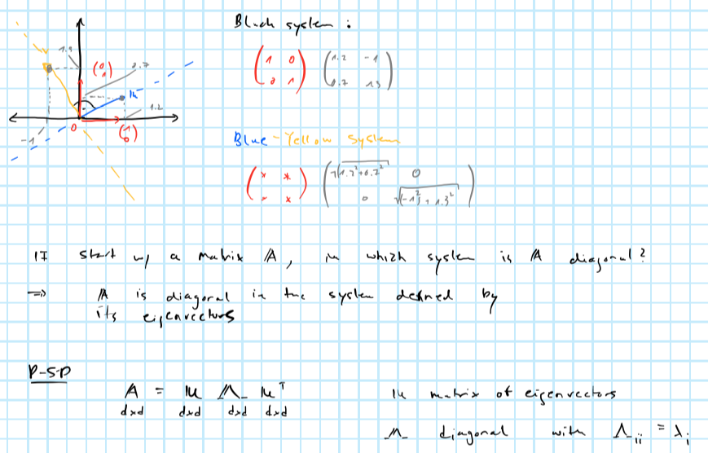

```{r setup, include=F}
rm(list=ls())
knitr::opts_chunk$set(echo = TRUE, message = F, warning = F)
```

# PCA

One of the most straight-forward ways to reduce model dimensionality is principal component analysis (PCA). Very loosely defined principal components can be thought of as describing the main sources of variation in the data. While in theory any design matrix $X$ $(n \times p)$ can be decomposed into its principal components, in practice PCA can be more or less useful for dimensionality reduction depending on how the $p$ different features in $X$ related to each other. We will see that in particular for highly correlated data PCA can be an extremely useful tool for dimensionality reduction.

## The maths behind PCA

The is no one way to do PCA, but two common ways to do it include singular value decomposition (SVD) and spectral/eigen decomposition. Here we will focus on the latter. 

PCA projects $X$ into a $q$-dimensional space where $q \le p$, such that the covariance matrix of the $q$-dimensional projection is maximised. Intuitively, we want to find the linear combination of points in $X$ which explains the largest part of the variance in $X$. Formally (in a very stylised fashion) this amounts to

$$
\begin{aligned}
&& \max_a& \left( \Omega = P_1^TP_1 = v^TX^TXv = v^T \Sigma v \right) \\
\text{s.t.} && v^Tv&= \mathbf{1} && \text{(loading vector)} \\
\text{where}&& P_1 &= v^T X && \text{(principal component)} \\
\end{aligned}
$$

where $v$ is given by the eigenvector corresponding to the largest eigenvalue of $\Sigma$ - the covariance matrix of $X$. We can eigen-decompose $\Sigma$

$$
\begin{aligned}
&& \Sigma&= V \Lambda V^{-1} \\
\end{aligned}
$$

where $\Lambda$ is a diagonal matrix of eigenvalues in decreasing order.

Sometimes eigenvectors $V$ are referred to as rotation vectors: the first eigenvector - i.e. the one corresponding to the highest eigenvalue - rotates the data into the direction of the highest variation. Remembers this image from the brush-ups?



## An intuitive example

PCA can be applied very well to highly correlated time series. Take for example US treasury yields of varying maturities over time: they are intrinsically linked to each other through the term-structure of interest rates. As we will see the first couple of principal components have a very intuitive interpretation when applied to yield curves.

```{r}
library(data.table)
library(ggplot2)
dt <- fread("data/ust_yields.csv")
dt_long <- melt(dt, id.vars = "Date")
ggplot(data=dt_long, aes(x=Date, y=value, alpha=variable)) +
  geom_line() +
  scale_alpha_discrete(
    name="Maturity:"
  ) +
  labs(
    x=NULL,
    y="Per cent"
  ) 
```

Let's perform PCA through spectral decomposition in R and look at the output. 

```{r}
X <- as.matrix(na.omit(dt[,-1]))
Sigma <- crossprod(X)
sdc <- eigen(Sigma)
V <- sdc$vectors
pct_var <- data.table(percent=sdc$values/sum(sdc$values)*100)
knitr::kable(head(pct_var))
```

Let's compute the first three principal components and plot them over time. How can we make sense of this? It is not obvious and in many applications interpreting the components at face value is a difficult task. In this particular example it turns out that we can actually make sense of them.

```{r}
# Retrieve first 3 principal components:
P_3 <- X %*% V[,1:3]
# Plot them:
pc_dt <- data.table(date = na.omit(dt)$Date, P_3)
pc_dt <- melt(pc_dt, id.vars = "date")
ggplot(data=pc_dt, aes(x=date, y=value, alpha=variable)) +
  geom_line() +
  scale_alpha_discrete(
    name="Principal component:"
  ) +
  labs(
    x=NULL,
    y="Value"
  ) 
```

Let's see what happens when we play with the components

```{r eval=F}
library(shiny)
yc_0 <- rep(0.05,ncol(X))
range <- -10:10
shinyApp(
  
  # --- User Interface --- #
  
  ui = fluidPage(
    
    sidebarPanel(
      sliderInput("pc1", label = "PC1", min = min(range), max=max(range), value = 0),
      sliderInput("pc2",label = "PC2", min = min(range), max=max(range), value = 0),
      sliderInput("pc3",label = "PC3", min = min(range), max=max(range), value = 0)
    ),
    
    mainPanel(
      plotOutput("plot")
    )
    
  ),
  
  # --- Server logic --- #
  
  server = function(input, output) {
    output$plot <- renderPlot(
      {
        req(input$pc1)
        V_trans <- V %*% diag(c(input$pc1,input$pc2,input$pc3,rep(1,ncol(V)-3)))
        plot_dt <- data.table(n=1:ncol(V), value=c(V_trans %*% yc_0))
        ggplot(data=plot_dt, aes(x=n, y=value)) + 
          geom_point() +
          geom_line()
      }
    )
  }
  
)
```


# Squared elements of eigenvectors

Consider again using the spectral decomposition of $\Sigma=\mathbf{X}^T\mathbf{X}$ to perform PCA:

$$
\begin{aligned}
&& \Sigma&= V \Lambda V^{-1} \\
\end{aligned}
$$

A practical complication with PCA is that generally the principal components cannot be easily interpreted. If we are only interested in prediction, then this may not be a concern. But when doing inference, we are interested in the effect of specific features rather than the principal components that describe the variation in the design matrix  $\mathbf{X}$. It turns out that we can still use spectral decomposition to select features directly. The clue is to realize that the $i$-th squared element $v^2_{ji}$ of the $j$-th eigenvector can be though of as the percentage contribution of feature $i$ to the variation in the $j$-th principal component. Having already established above that eigenvalues provide a measure of how much of the overall variation in $X$ is explained by the $j$-th principal component, these two ideas can be combined to give us a straight-forward way to identify important features (for explaining variation in $\mathbf{X}$). In particular, compute $\mathbf{s}= \text{diag}\{\Lambda\}/ \text{tr} (\Lambda)$ $(p \times 1)$ where $\Lambda$ is diagonal matrix of eigenvalues and let $\mathbf{V}^2$ be the matrix of eigenvectors with each elements squared. Consider computing the following vector $\mathbf{r} \in \mathbb{R}^p$ which will use to rank our $p$ features:

$$
\begin{equation} 
\begin{aligned}
&& \mathbf{r}&=\mathbf{V}^2 \mathbf{s} \\
\end{aligned}
(\#eq:ranking)
\end{equation}
$$

By construction elements in $\mathbf{r}$ sum up to one so they can be thought of as percentages describing the overall importance of individual features *in terms of explaining the overall variation in the design matrix*. 

```{r}
s <- sdc$values/sum(sdc$values)
r <- (V**2) %*% s
q <- 5
```

Then say we were interested in decreasing the number of features from $p=`r ncol(V)`$ to $q=`r q`$, then this approach suggests using the following features:

```{r}
ranking <- data.table(
  feature = colnames(dt)[-1],
  importance = c(r)
)
setorder(ranking, -importance)
knitr::kable(head(ranking,q))
```


