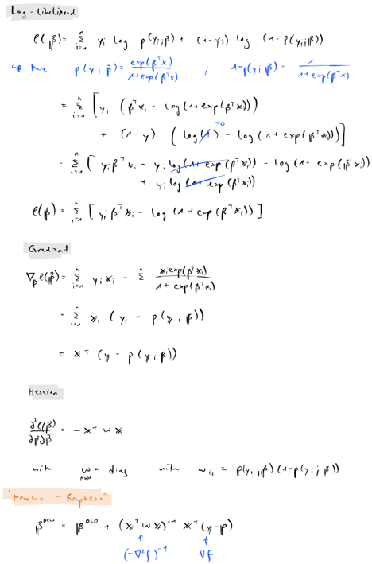

```{r setup, include=F}
rm(list=ls())
knitr::opts_chunk$set(echo = TRUE, message = F, warning = F)
```

The goal of this exercise is to investigate if and how systematic sub-sampling in situations where $n>>p$ can be applied to imbalanced learning. The note is structured as follows: to set the stage for the final investigation the first [section](#bias) briefly introduces the bias-variance trade-off. The following [section](#subsampling) then introduces various subsampling methods. Section \@ref(lin-reg) illustrates the improvements associated with non-uniform subsampling. The final two sections then apply the ideas to binary classification problems with imbalanced training data.

# Bias-variance tradeoff {#bias}

```{r}
source("R/gauss_kernel.R")
source("R/sinusoidal.R")
source("R/sim_sinusoidal.R")
source("R/regularized_ls.R")
# Generate data: ----
n <- 25
p <- 24
a <- 0
b <- 1
x <- seq(a,b,length.out = n)
y <- sinusoidal(x)
v <- 0.3
```

As our data generating process for $y$ we will consider the sinusoidal function $f(x)=\sin(2\pi x)$ as in @bishop2006pattern. To simulate random samples of $y$ we sample $n$ input values from $x \sim \text{unif}(0,1)$ and introduce some white noise $\varepsilon \sim \mathcal{N}(0,`r v`)$. Figure \@ref(fig:p_sim) shows $y$ along with random draws $y^*_n$.

```{r p_sim, fig.cap="Sinusoidal function and random draws."}
# True data: ----
library(ggplot2)
library(data.table)
dt_true <- data.table(y,x)
pl <- ggplot(data=dt_true, aes(x=x, y=y)) +
  geom_line()
# Simulate data: ----
n_draws <- 3
dt_star <- rbindlist(
  lapply(
    1:n_draws,
    function(x) {
      simulated <- sim_sinusoidal(n=n, sigma = v)
      data.table(y=simulated$y_star, x=simulated$x_star, n=1:n, draw=x)
    }
  )
)
pl +
  geom_point(
    data = dt_star,
    aes(x=x, y=y, colour=factor(draw))
  ) +
  scale_colour_discrete(
    name="Draw:"
  )
```

```{r param-setup}
lambda <- c(
  exp(2.6),
  exp(-0.31),
  exp(-2.4)
)
s <- 0.1
n_draws <- 100
mu <- seq(a,b,length.out = p)
```

As in @bishop2006pattern we will use a Gaussian linear model with Gaussian kernels $\exp(- \frac{(x_k-\mu_p)^{2}}{2s^2})$ to estimate $\hat{y}_k$ from our data $(y_k,x_k)$

$$
\begin{equation} 
\begin{aligned}
&& y|x& =f(x) \sim \mathcal{N} \left( \sum_{j=0}^{p-1} \phi_j(x)\beta_j, v \mathbb{I}_p \right) \\
\end{aligned}
(\#eq:model)
\end{equation}
$$

with $v=`r v`$. We fix the number of kernels $p=`r p`$ (and hence the number of features $M=p+1=`r p+1`$) as well as the spatial scale $s=`r s`$. To vary the complexity of the model we use a form of regularized least-squares (*Ridge regression*) and let the regularization parameter $lambda$ vary

$$
\begin{equation} 
\begin{aligned}
&& \hat\beta&=(\lambda I + \Phi^T \Phi)^{-1}\Phi^Ty \\
\end{aligned}
(\#eq:reg-ls)
\end{equation}
$$

where high values of $\lambda$ in \@ref(eq:reg-ls) shrink parameter values towards zero. (Note that a choice $\lambda=0$ corresponds to the OLS estimator.)
As in @bishop2006pattern we proceed as follows for each choice of $\lambda$ and each sample draw:

1. Draw $N=`r n`$ time from $u \sim \text{unif}(`r a`,`r b`)$. 
2. Let $x_k^*=u+\varepsilon$ with $\varepsilon \sim \mathcal{N}(0, `r v`)$.
3. Compute $y_k^*=\sin(2\pi x^*_k)$.
4. Extract features $\Phi_k$ from $x_k^*$ and estimate the parameter vector $\beta_k^*(\Phi_k,y_k,\lambda)$ through regularized least-squares. 
5. Predict $\hat{y}_k^*=\Phi \beta_k^*$.

```{r}
Phi <- cbind(
  rep(1,n),
  sapply(
    1:length(mu),
    function(p) {
      mu_p <- mu[p]
      gauss_kernel(x=x, mu=mu_p, s = s)
    }
  )
)
dt <- rbindlist(
  lapply( # loop - draw K times
    1:n_draws,
    function(k) {
      # Draw:
      simulated <- sim_sinusoidal(n=n, sigma = v)
      y_k <- simulated$y_star
      x_k <- simulated$x_star
      rbindlist(
        lapply( # loop over regularization parameter
          1:length(lambda),
          function(t) {
            # Regularization parameter:
            lambda_t <- lambda[t]
            # Extract features:
            Phi_k <- cbind(
              rep(1,n),
              sapply(
                1:length(mu),
                function(p) {
                  mu_p <- mu[p]
                  gauss_kernel(x=x_k, mu=mu_p, s = s)
                }
              )
            )
            beta_hat <- regularized_ls(Phi_k,y_k,lambda_t) # fit model on (y,x)
            y_hat <- c(Phi %*% beta_hat) # predict from model
            dt <- data.table(value=y_hat,draw=k,lambda=lambda_t,n=1:n,x=x)
            return(dt)
          }
        )
      )
    }
  )
)
dt[,facet_group:="single"]
dt[,colour_group:="estimates"]
# Expected values:
dt_exp = dt[,.(value=mean(value)),by=.(lambda,n,x)]
dt_exp[,facet_group:="aggregate"]
dt_exp[,colour_group:="estimates"]
dt_exp[,draw:=1] # just for aesthetics
# True values:
library(reshape)
dt_true = data.table(expand.grid.df(data.frame(value=y,x=x),data.frame(lambda=lambda)))
dt_true[,facet_group:="aggregate"]
dt_true[,colour_group:="true"]
dt_true[,draw:=2] # just for aesthetics
# Plot data:
dt_plot = rbind(
  dt,
  dt_exp,
  dt_true,
  fill=T
)
```

Recall that for the mean-squared error (MSE) we have 

$$
\begin{equation} 
\begin{aligned}
&& \mathbb{E} \left( (\hat{f}_n(x)-f(x))^2 \right)
&= \text{var} (\hat{f}_n(x)) + \left( \mathbb{E} \left( \hat{f}_n(x) \right) - f(x) \right)^2 \\
\end{aligned}
(\#eq:mse)
\end{equation}
$$

where the first term on the right-hand side corresponds to the variance of our prediction and the second term to its (squared) bias. Applying the above procedure we can construct the familiar picture that demonstrates how increased model complexity increases variance while reducing bias (Figure \@ref(fig:plot-bias-var)).

```{r plot-bias-var, fig.cap="Bias-variance trade-off"}
dt_plot[,log_lambda := log(lambda)]
ggplot(data=dt_plot[draw<=25], aes(y=value, x=x, colour=colour_group, group=draw)) +
  geom_line() +
  facet_grid(
    rows = vars(log_lambda),
    cols = vars(facet_group)
  )
```
# Sub-sampling methods {#subsampling}

```{r}
source("R/UNIF.R")
source("R/BLEV.R")
source("R/OPT.R")
source("R/PL.R")
source("R/wls_qr.R")
source("R/rorthogonal.R")
source("R/sim_subsampling.R")
n <- 1000
m <- 10
p <- 10
```


Let us now consider the case for sub-sampling: $n >> p$. We continue with the sinusoidal function from above but now look at the case where the number of observations is $n=`r n`$ and the number of features is $p=`r p`$. Suppose we are interested in estimating $\hat\beta_m$ instead of $\hat\beta_m$ where $p\le m=`r m`<<n$ with $m$ freely chosen by us. In practice we may want to do this to avoid high computational costs associated with large $n$. Or perhaps we are only allowed to load to access $m$ observations at a time. The basic algorithm for performing estimating $\hat\beta_m$ is as follows:

1. Subsample with replacement from the data with sampling probability $\{\pi_i\}^n_{i=1}$.
2. Estimate least-squares estimator $\hat\beta_m$ using the subsample. 

But there are at least two questions about this algorithm: firstly, how do we choose $X_m=x^{(1)},...,x^{(m)}$? Secondly, how should we construct $\hat\beta_m$? With respect to the former, a better idea than just randomly selecting $X_m$ might be to choose observations with high influence. We will look at  a few of the different subsampling methods investigated and proposed in @zhu2015optimal, which differ primarily in their choice of subsampling probabilities $\{\pi_i\}^n_{i=1}$:

1. Uniform subsampling (UNIF): $\{\pi_i\}^n_{i=1}=1/n$.
2. Basic leveraging (BLEV): $\{\pi_i\}^n_{i=1}=h_{ii}/ \text{tr}(\mathbb{H})=h_{ii}/p$ where $\mathbb{H}$ is the *hat matrix*.
3. Predictor-length sampling (PL): $\{\pi_i\}^n_{i=1}= ||x_i||/ \sum_{i=1}^{n}||x_i||$ where $||x||$ denotes the $L_2$ norm of $x$.

The PL method is proposed by the authors and shown to scale very well and is good approximation conditional on leverage scores $h_{ii}$ being fairly homogenous.

With respect to the second question @zhu2015optimal investigate both ordinary least-squares (OLS) and weighted least-squares (WLS), where weights simply correspond to subsampling probabilities $\{\pi_i\}^n_{i=1}$. The authors present empirical evidence that OLS is more efficient than WLS in that the mean-squared error (MSE) for predicting $\Phi \beta$ is lower for OLS. Unfortunately though subsampling using OLS is not consistent for non-uniform subsampling methods meaning that the bias cannot be controlled. Given Equation \@ref(eq:mse) this implies that the variance of predictions is higher with WLS and that this effect dominates the effect of relatively higher bias with OLS. In fact this is consistent with the theoretical results presented in @zhu2015optimal (more on this below).

Next we will briefly run through different subsampling and estimation methods ins some more detail and see how they can be implemented in R. In the following [section](#lin-reg) we will then look at how the different approaches perform empirically.

## OLS and WLS

Both OLS and WLS are implemented using QR decompostion. As for OLS this is very easily done in R. Given some feature matrix `Phi` and a corresponding outcome variable `y` we can use `qr.solve(Phi, y)` compute $\hat\beta$. For WLS we need to first weigh observations by their corresponding subsampling probabilities. Following @zhu2015optimal we can construct a weighting matrix $\Omega= \text{diag}\{\pi_i\}^m_{i=1}$ and compute the weighted least-squares estimator as:

$$
\begin{equation} 
\begin{aligned}
&& \hat\beta_m^{WLS}&= \left( \Phi^T \Omega^{-1} \Phi \right)^{-1} \Phi^T\Omega^{-1}y\\
\end{aligned}
(\#eq:wls)
\end{equation}
$$
The derivation for \@ref(eq:wls) is as follows (note that here I'm using the same notation as in @zhu2015optimal where $\Phi$ corresponds to our $\Omega$ and $X$ to our $\Phi$):


In R this can be wrapped up in a simple function:

```{r class.source = "fold-show", code=readLines("R/wls_qr.R"), echo=T}
```

## Uniform leveraging (UNIF)

A simple function for uniform leveraging in R is shown in the code chunk below. Note that to streamline the comparison of the different methods in the following [section](#lin-reg) the function takes an unused argument `weighted=F` which for the other subsampling methods can be used to determine wether OLS or WLS should be used. Of course, with uniform leveraging the weights are all identical so $\hat\beta^{OLS}=\hat\beta^{WLS}$ so the argument is passed to but not evaluated in `UNIF`. (There are likely more elegant ways to do this!) 

```{r class.source = "fold-show", code=readLines("R/UNIF.R"), echo=T}
```

## Basic leveraging (BLEV)

The `UNIF` function can be extended easily to the case with basic leveraging (see code below). Note that in this case the `weighted` argument is evaluated.  

```{r class.source = "fold-show", code=readLines("R/BLEV.R"), echo=T}
```

### A note on computing leverage scores

Recall that for the *hat matrix* we have

$$
\begin{equation} 
\begin{aligned}
&& \mathbb{H}&=\Phi (\Phi^T \Phi)^{-1}\Phi^T \\
\end{aligned}
(\#eq:hat-mat)
\end{equation}
$$

where the diagonal elements $h_{ii}$ correspond to the leverage scores we're after. Following @zhu2015optimal we will use (compact) singular value decomposition to obtain $\mathbb{H}$ rather than computing \@ref(eq:hat-mat) directly. This has the benefit that there exist exceptionally stable numerical algorithms to compute SVD. (**source**) To see why we can use SVD to obtain $\mathbb{H}$ consider the following:


Clearly to get $h_{ii}$ we first need to compute $\mathbb{H}$ which in terms of computational costs is of order $\mathcal{O}(np^2)=\max(\mathcal{O}(np^2),\mathcal{O}(p^3))$. The fact that we use all $n$ rows of $\Phi$ to compute leverage scores even though we explicitly stated our goal to only use $m$ observations is a bit of a paradox. This is why fast algorithms that approximate leverage scores have been proposed. We will not look at them specifically here mainly because the method proposed by @zhu2015optimal promises to be computationally even more efficient.

## Predictor-length sampling (PL)

The basic characteristic of PL subsampling - choosing $\{\pi_i\}^n_{i=1}= ||x_i||/ \sum_{j=1}^{n}||x_j||$ - was already introduced above. Again it is very easy to modify the subsampling functions from above to this case:

```{r class.source = "fold-show", code=readLines("R/PL.R")}
```

### A note on optimal subsampling (OPT)

In fact, this PL subsampling is an approximate version of optimal subsampling (OPT). @zhu2015optimal show that variance $V=\text{var} (\hat{f}_n(x))$ dominates squared bias $\left( \mathbb{E} \left( \hat{f}_n(x) \right) - f(x) \right)^2$. More specifically they show that asymptotically

$$
\begin{equation} 
\begin{aligned}
&& V&\rightarrow m^{-1} \\
\end{aligned}
(\#eq:var-asymp)
\end{equation}
$$

and 

$$
\begin{equation} 
\begin{aligned}
&& \left( \mathbb{E} \left( \hat{f}_n(x) \right) - f(x) \right)^2&\rightarrow (m^{-1})^2 \\
\end{aligned}
(\#eq:var-bias)
\end{equation}
$$

where $m$ is the size of the subsample as before. Given this result minimizing the MSE (Equation \@ref(eq:mse)) with respect to subsampling probabilities $\{\pi_i\}^n_{i=1}$ is equivalent to minimizing $V$. They further show that this minimization problem has the following closed-form solution:

$$
\begin{equation} 
\begin{aligned}
&& \pi_i&= \frac{\sqrt{(1-h_{ii})}||x_i||}{\sum_{j=1}^n\sqrt{(1-h_{jj})}||x_j||}\\
\end{aligned}
(\#eq:opt)
\end{equation}
$$

This still has computational costs of order $\mathcal{O}(np^2)$. But now it becomes clear why PL subsampling is optimal conditional on leverage scores being homogenous:


PL subsampling is associated with computational costs of order $\mathcal{O}(np)$ so a great improvement in particular when both $n$ and $p$ are large. 

## Comparison of methods

```{r}
n <- 1000
p <- 100
```


As discussed in @zhu2015optimal both OPT and PL subsampling tend to inflate subsampling probabilities of observations with low leverage scores and shrink those of high-leverage observations relative to BLEV. They show explicitly that this always holds for orthogonal design matrices. As a quick sense-check of the function introduced above we can generate a random orthogonal design matrix $X$ and plot subsampling probabilities with OPT and PL against those obtained with BLEV. Figure \@ref(fig:comp-methods) illustrates this relationship nicely. I have generated $X$ $(n \times p)$ with $n=`r n`$ and $p=`r p`$ using SVD:

```{r rortho, code=readLines("R/rorthogonal.R")}
```


```{r comp-methods, fig.cap="Comparison of subsampling probabilities."}
X <- rorthogonal(n,p)
# Subsampling methods:
methods <- list(
  "UNIF" = UNIF,
  "BLEV" = BLEV,
  "OPT" = OPT,
  "PL" = PL
)
smpl_probs <- rbindlist(
  lapply(
    names(methods)[2:4],
    function(i) {
      method <- i
      prob <- methods[[method]](X, y=NULL, m=NULL, prob_only=T)
      return(data.table(prob=prob, method=method))
    }
  )
)
dt_plot <- rbindlist(
  lapply(
    names(methods)[3:4],
    function(i) {
      other_method <- i
      x <- smpl_probs[method=="BLEV"]$prob
      y <- smpl_probs[method==other_method]$prob
      data.table(x=x, y=y, y_var=other_method)
    }
  )
)
ggplot(dt_plot, aes(x=x, y=y)) +
  geom_abline(intercept = 0, slope=1, linetype="dashed") +
  geom_point(shape=1) +
  facet_grid(
    cols=vars(y_var)
  ) +
  labs(
    x="BLEV",
    y=""
  )
```


# Linear regression model {#lin-reg}

## A review of @zhu2015optimal

To illustrate the improvements associated with the methods proposed in @zhu2015optimal, we will briefly replicate their main empirical findings here. The evaluate the performance of the different methods we will proceed as follows:

**Numerical exercise**

1. Generate synthetic data $X$ of dimension $(n \times m)$ with $n>>m$. 
2. Set some true model parameter $\beta=(\mathbf{1}^T_{\overline{m*0.6}},\mathbf{1}^T_{\underline{m*0.4}})^T$.
3. Model the outcome variables as $y=X\beta+\epsilon$ where $\epsilon \sim \mathcal{N}(\mathbf{0},\sigma^2 \mathbf{I}_n)$ and $\sigma=10$.
4. Estimate the full-sample OLS estimator $\hat\beta_n$ (a benchmark estimator of sorts in this setting).
5. Use one of the subsampling methods to estimate iteratively $\{\hat\beta^{(b)}_m\}^B_{b=1}$. Note that all subsampling methods are stochastic so $\hat\beta_m$ varies across iterations.
6. Evaluate average model performance of $\hat\beta_m$ under the mean-squared error criterium: $MSE= \frac{1}{B} \sum_{b=1}^{B} MSE^{(b)}$ where $MSE^{(b)}$ corresponds to the in-sample estimator of the mean-squared error of the $b$-th iteration.

In R we will use the following function for this purpose:

```{r class.source = "fold-show", code=readLines("R/sim_subsampling.R")}
```

```{r}
n <- 1000
p <- 3
```

As in @zhu2015optimal we will generate the design matrix $X$ from 5 different distributions: 1) Gaussian (GA) with $\mathcal{N}(\mathbf{0},\Sigma)$; 2) Mixed-Gaussian (MG) with $0.5\mathcal{N}(\mathbf{0},\Sigma)+0.5\mathcal{N}(\mathbf{0},25\Sigma)$; 3) Log-Gaussian (LN) with $\log\mathcal{N}(\mathbf{0},\Sigma)$; 4) T-distribution with 1 degree of freedom (T1) and $\Sigma$; 5) T-distribution as in 4) but truncated at $[-p,p]$. All parameters are chosen in the same way as in @zhu2015optimal with exception of $n=`r n`$ and $p=`r p`$, which are significantly smaller choices in order to decrease the computational costs. The corresponding densities of the 5 data sets are shown in Figure \@ref(fig:dens) in the [appendix](#app). 

We will run the numerical exercise for each data set and each subsampling method introduced above. Figure \@ref(fig:plot-smpl-prob) shows logarithms of the sampling probabilities corresponding to the different subsampling methods (UNIF not shown for obvious reasons). The plots look very similar to the one in @zhu2015optimal and is shown here primarily to reassure ourselves that we have implemented their ideas correctly. One interesting observation is worth pointing out however: note how the distributions for OPT and PL have lower standard deviations compared to BLEV. This should not be altogether surprising since we already saw above that for orthogonal design matrices the former methods inflate small leverage scores while shrinking high scores. But it is interesting to see that the same appears to hold for design matrices that are explicitly not orthogonal given our choice of $\Sigma$.

```{r zhu-data}
set.seed(1)
library(expm)
matrix_grid <- expand.grid(i=1:p,j=1:p)
Sigma <- matrix(rep(0,p^2),p,p)
for (x in 1:nrow(matrix_grid)) {
  i <- matrix_grid$i[x]
  j <- matrix_grid$j[x]
  Sigma[i,j] <- 2 * (0.8)^(abs(i-j))
}
# 1.) Design matrix (as in Zhu et al): ----
GA <- matrix(rnorm(n*p), nrow = n, ncol = p) %*% sqrtm(t(Sigma))
# Gaussian mixture:
gaus_mix <- list(
  gaus_1 = matrix(rnorm(n*p), nrow = n, ncol = p) %*% sqrtm(t(Sigma)),
  gaus_2 = matrix(rnorm(n*p), nrow = n, ncol = p) %*% sqrtm((25 * t(Sigma)))
)
MG <- matrix(rep(0,n*p),n,p)
for (i in 1:nrow(MG)) {
  x <- sample(1:2,1)
  MG[i,] <- gaus_mix[[x]][i,]
}
# Log-Gaussian:
LN <- exp(GA)
# T-distribution:
T1 <- matrix(rt(n*p,1), nrow = n, ncol = p) %*% sqrtm(t(Sigma))
# Truncated T:
TT <- T1
TT[TT>p] <- p
TT[TT<(-p)] <- -p
data_sets <- list(
  GA = list(X = GA),
  MG = list(X = MG),
  LN = list(X = LN),
  TT = list(X = TT),
  T1 = list(X = T1)
)
# 2.) Outcome:
data_sets <- lapply(
  data_sets,
  function(i) {
    X <- i[["X"]]
    beta <- c(rep(1,ceiling(0.6*p)),rep(0.1,floor(0.4*p)))
    eps <- rnorm(n=n,mean=0,sd=10)
    y <- X %*% beta + eps
    list(X=X, y=y)
  }
)
saveRDS(data_sets, "outputs/synthetic_data.rds")
```

```{r smpl-prob, eval=F}
pgrid <- expand.grid(method = names(methods)[2:4], data=names(data_sets))
smpl_probs <- rbindlist(
  lapply(
    1:nrow(pgrid),
    function(i) {
      method <- as.character(pgrid$method[i])
      data_set <- pgrid$data[i]
      X <- data_sets[[data_set]]$X
      y <- data_sets[[data_set]]$y
      prob <- methods[[method]](X, y, m=NULL, prob_only=T)
      return(data.table(prob=prob, method=method, data=data_set))
    }
  )
)
saveRDS(smpl_probs, "outputs/smpl_probs.rds")
```

```{r load-smpl-probs}
smpl_probs <- readRDS("outputs/smpl_probs.rds")
```


```{r plot-smpl-prob, eval=F, fig.width=10, fig.height=4}
pgrid <- expand.grid(method = names(methods)[3:4], data=names(data_sets))
dt_plot <- rbindlist(
  lapply(
    1:nrow(pgrid),
    function(i) {
      other_method <- as.character(pgrid$method[i])
      data_set <- pgrid$data[i]
      x <- smpl_probs[method=="BLEV" & data==data_set]$prob
      y <- smpl_probs[method==other_method & data==data_set]$prob
      data.table(x=x, y=y, y_var=other_method, data=data_set)
    }
  )
)
ggplot(dt_plot, aes(x=x, y=y)) +
  geom_abline(intercept = 0, slope=1, linetype="dashed") +
  geom_point(shape=1) +
  facet_wrap(
    y_var ~ data,
    scales = "free",
    ncol=length(data_sets)
  ) +
  labs(
    x="BLEV",
    y=""
  )
```

```{r, fig.height=4, fig.width=10, fig.cap="Sampling probabilities for different subsampling methods."}
ggplot(
  data = smpl_probs,
  aes(x=data, y=log(prob)) 
) +
  geom_boxplot() +
  facet_grid(
    col=vars(method)
  )
```

```{r}
# Simulation parameters:
m <- c()
counter <- 1
while(length(m)<7 & max(m/n)<.1) {
  temp <- max(p,(2^(counter)*1e-3) * n)
  m <- unique(c(m, temp))
  counter <- counter + 1
}
weighted <- c(T,F)
pgrid <- data.table(
  expand.grid(
    m=m, 
    method=names(methods), 
    weighted=weighted, 
    data_set=names(data_sets)
  )
)
```

```{r,eval=F}
set.seed(1)
grid_search <- rbindlist(
  lapply(
    1:nrow(pgrid),
    function(i) {
      m <- pgrid[i,m]
      estimator_name <- pgrid[i,method] 
      estimator <- methods[[estimator_name]]
      weighted <- pgrid[i, weighted]
      data_set <- pgrid$data[i]
      X <- data_sets[[data_set]]$X
      y <- data_sets[[data_set]]$y
      output <- sim_subsampling(X, y, m, estimator, weighted=weighted)
      output[,m:=m]
      output[,method:=estimator_name]
      output[,weighted:=weighted]
      output[,data_set:=data_set]
    }
  )
)
grid_search[,weighted:=factor(weighted)]
levels(grid_search$weighted) <- c("OLS","WLS")
grid_search[,log_value:=log(value)]
saveRDS(grid_search, file="outputs/grid_search_zhu.rds")
```

```{r}
grid_search <- readRDS("outputs/grid_search_zhu.rds")
p_list <- lapply(
  1:2,
  function(i) {
    ggplot(
      data=grid_search[weighted==levels(weighted)[i]], 
      aes(x=m/n, y=log_value, colour=method)
    ) +
      geom_line() +
      geom_point() +
      facet_grid(
        rows = vars(variables),
        cols = vars(data_set),
        scales = "free_y"
      ) +
      scale_color_discrete(
        name="Subsampling method:"
      ) +
      labs(
        x="m/n",
        y="Logarithm",
        title=levels(grid_search$weighted)[i]
      ) 
  }
)
names(p_list) <- levels(grid_search$weighted)
```

Figures \@ref(fig:wls-zhu) and \@ref(fig:ols-zhu) show the resulting MSE, squared bias and variance for the different subsampling methods and data sets using weighed least-squares and ordinary least-squares, respectively. The subsampling size increases along the horizontal axis. 

For the data sets that are also shown in @zhu2015optimal we find the same overall pattern: PL and OPT outperform other methods when using weighted least-squares, while BLEV outperforms other methods when using unweighted/ordinary least-squares. For Gaussian data (GA) the differences between the methods are minimal since data points are homogenous. In fact, @zhu2015optimal recommend to just rely on uniform subsampling when data is Gaussian. Another interesting observations is that for t-distributed data (T1) the non-uniform subsampling methods significantly outperform uniform subsampling methods. This is despite the fact that in the case of T1 data the conditions used to establish asymptotic consistency of the non-uniform subsampling methods in @zhu2015optimal are not fullfilled: in particular the fourth moment is not finite (in fact it is not defined). This is curious: even though we may not want to use subsampling at all if this condition is not met, we should at least employ non-uniform subsampling if we really do have to estimate $\beta$ through subsampling.

```{r wls-zhu, fig.height=5, fig.width=10, fig.cap="MSE, squared bias and variance for different subsampling methods and data sets. Subsampling with weighted least-squares."}
p_list$WLS
```

```{r ols-zhu, fig.height=5, fig.width=10, fig.cap="MSE, squared bias and variance for different subsampling methods and data sets. Subsampling with ordinary least-squares."}
p_list$OLS
```

# Classification problems

```{r}
source("R/undersampling.R")
source("R/sim_undersampling.R")
source("R/logit_irls.R")
```


In binary classification problems we are often faced with the issue of imbalanced training data - one of the two classes is under-represented relative to the other. This generally makes classifiers less sensitive to the minority class which often is the class we want to predict (@branco2015survey). Suppose for example we wanted to predict the probability of death for patients who suffer from COVID-19. The case-fatality rate for the virus is significantly lower than 10% so any data we could obtain on patients would inevitably be imbalanced: the domain is skewed towards the class we are not interested in predicting.

A common and straight-forward way to deal with this issue is to randomly over- or under-sample the training data. Let $y_i\in{0,1}$ for all $i=1,...,n$. We are interested in modelling $p_i=P(y_i=1|x_i)$ but our data is imbalanced: $n_{y=0}>>n_{y=1}$ where $n=n_{y=0}+n_{y=1}$. Then random over- and under-sampling works as follows:

1. *Random oversampling*: draw $y_i$ from minority class $y_{n_{y=1}}$ with probability $\{\pi_i\}^{n_{y=1}}_{i=1}=1/n_{y=1}$ and append $y_{n_{y=1}}$ by $y_i$ so that $n_{y=1} \leftarrow n_{y=1}+1$ until $n_{y=0}=n_{y=1}$.
2. *Random undersampling*: draw $y_i$ from majority class $y_{n_{y=0}}$ with probability $\{\pi_i\}^{n_{y=0}}_{i=0}=1/n_{y=0}$ and remove $y_i$ from $y_{n_{y=0}}$ so that $n_{y=0} \leftarrow n_{y=0}-1$ until $n_{y=0}=n_{y=1}$.
  
In a way both these methods correspond to uniform subsampling (UNIF) discussed above. Random oversampling may lead to overfitting. Conversely, random undersampling may come at the cost of elimination observations with valuable information. With respect to the latter, we have already shown that more systematic subsampling approaches generally outperform uniform subsampling in linear regression problems. It would be interesting to see if we can apply these ideas to classification with imbalanced data. How exactly we can go about doing this should be straight-forward to see:

3. *Non-juvenile undersampling*: draw $n_{y=1}$ times from from majority class $y_{n_{y=0}}$ with probability $\{\pi_i\}^{n_{y=0}}_{i=0}$ defined by BLEV/OPT/PL. 

To remain in the subsampling framework we will focus on undersampling here. It should be noted that many other more sophisticated approaches to undersampling already exist. In their extensive survey @branco2015survey mention undersampling methods based on distance-criteria, condensed nearest neighbours as active learning methods. Optimal subsampling as in @zhu2015optimal is not mentioned. 

## Synthetic data

```{r}
n <- length(data_sets$GA$y)
prob <- 0.05
# y <- sample(c(1,0), n, T, prob=c(prob,1-prob))
```

In this section we will use the same synthetic data sets as above for our design matrix $X$. But while above we sampled $y_i |x_i\sim \mathcal{N}(\beta^T x_i,\sigma)$, here we will simulate a single draw from $y |X \sim \text{Bernoulli}(p)$, where in order to create imbalance we set $p=`r prob`$ (an overestimate of the true case-fatality rate of COVID if you want). To model the probability of $y=1$ we will use logistic regression:

$$
\begin{equation} 
\begin{aligned}
&& p&= \frac{ \exp( \mathbf{X} \beta )}{1 + \exp(\mathbf{X} \beta)}
\end{aligned}
(\#eq:log-reg)
\end{equation}
$$

Equation \@ref(eq:log-reg) is not estimated directly but rather derived from linear predictions

$$
\begin{equation} 
\begin{aligned}
\log \left( \frac{p}{1-p} \right)&= \mathbf{X} \beta \\
\end{aligned}
(\#eq:lin-pred)
\end{equation}
$$
where $\beta$ can be estimated through iterative re-weighted least-squares (IRLS) which is simple implementation of Newton's method (see for example @wasserman2013all; a complete derivation can also be found in the [appendix](#irls)):

$$
\begin{equation} 
\begin{aligned}
&& \beta_{s+1}&= \left( \mathbf{X}^T \mathbf{W} \mathbf{X} \right) \mathbf{X}^T \mathbf{W}z\\
\text{where}&& z&= \mathbf{X}\beta_{s} + \mathbf{W}^{-1} (y-p) \\
&& \mathbf{W}&= \text{diag}\{p_i(\beta_{s})(1-p_i(\beta_{s}))\}_{i=1}^n \\ 
\end{aligned}
(\#eq:irls)
\end{equation}
$$
In R this can be implemented as below. The function also implements weighted logistic regression which we will use in the same way we used weighted least-squares above. Alternatively one could of course just use `glm([formula], family="binomial")` to do this in R.

```{r, code=readLines("R/logit_irls.R")}
```

Logistic regression offers an ideal testing ground for the subsampling methods introduced earlier: while we would not generally use the MSE to compare predicted probabilities as in \@ref(eq:log-reg), we *can* use it to compare the linear predictions in \@ref(eq:lin-pred) in the same way as we did earlier. This has the advantage that bias-variance decomposition works in the exact same way as before. As a first step we will therefore repeat the numerical exercise from above, but now applied to linear predictions for our binary outcome variable $y$.

### Model selection

The resulting mean-squared error decompositions are shown in Figures \@ref(fig:wls-logit) and \@ref(fig:ols-logit) for weighted and ordinary least-squares. As pointed out above, the MSE and its components correspond to the linear predictions of the model (Equation \@ref(eq:lin-pred)) rather than predicted probabilities. The observed patterns are broadly in line with what we observed in Section \@ref(lin-reg).

.... 

This is both reassuring and perhaps altogether not entirely surprising: after all we are using same synthetic data as before and still computing linear predictions. Nonetheless it has been a useful exercise: we have now cleared the ground to move on to our final question - does non-uniform undersampling produce better out-of-sample predictions? We shall turn to this in the final section where will treat real data.

```{r}
# Simulation parameters:
data_sets <- tryCatch(
  data_sets,
  error = function(e) {
    readRDS("outputs/synthetic_data.rds")
  }
)
n <- 1000
m <- 2^(3:7)*1e-3
weighted <- c(T,F)
pgrid <- data.table(
  expand.grid(
    m=m, 
    method=names(methods), 
    weighted=weighted, 
    data_set=names(data_sets)
  )
)
methods <- list(
  "UNIF" = UNIF,
  "BLEV" = BLEV,
  "OPT" = OPT,
  "PL" = PL
)
```

```{r, eval=F}
set.seed(1)
grid_search <- rbindlist(
  lapply(
    1:nrow(pgrid),
    function(i) {
      m <- pgrid[i,m]
      estimator_name <- pgrid[i,method] 
      estimator <- methods[[estimator_name]]
      weighted <- pgrid[i, weighted]
      data_set <- pgrid$data[i]
      X <- data_sets[[data_set]]$X
      y <- sample(c(1,0),size=n,rep=T,prob = c(m,1-m))
      vars <- undersampler(X,y) # undersampler instance
      output <- sim_undersampling(vars, estimator, weighted=weighted)
      output[,m:=m]
      output[,method:=estimator_name]
      output[,weighted:=weighted]
      output[,data_set:=data_set]
    }
  )
)
grid_search[,weighted:=factor(weighted)]
levels(grid_search$weighted) <- c("Logit","Weighted Logit")
grid_search[,log_value:=log(value)]
saveRDS(grid_search, file="outputs/grid_search_logit.rds")
```

```{r}
grid_search <- readRDS("outputs/grid_search_logit.rds")
p_list <- lapply(
  1:2,
  function(i) {
    ggplot(
      data=grid_search[weighted==levels(weighted)[i]], 
      aes(x=m, y=value, colour=method)
    ) +
      geom_line() +
      geom_point() +
      facet_grid(
        rows = vars(variables),
        cols = vars(data_set),
        scales = "free_y"
      ) +
      scale_color_discrete(
        name="Subsampling method:"
      ) +
      labs(
        x="Proportion of sample",
        y="Value",
        title=levels(grid_search$weighted)[i]
      ) 
  }
)
names(p_list) <- levels(grid_search$weighted)
```

```{r wls-logit, fig.height=5, fig.width=10, fig.cap="MSE, squared bias and variance for different subsampling methods and data sets. Subsampling with weighted logistic regression. MSE and its components correspond to linear predictions of logistic regression."}
p_list$`Weighted Logit`
```


```{r ols-logit, fig.height=5, fig.width=10, fig.cap="MSE, squared bias and variance for different subsampling methods and data sets. Subsampling with ordinary logistic regression. MSE and its components correspond to linear predictions of logistic regression."}
p_list$Logit
```

## Real data example

Until now we have merely shown that non-uniform undersampling leads to better approximations of $\hat\beta_n$ for logistic regression. But ultimately the goal in classification problems is to accurately predict $y$ from test data. The results so far are a promising start: it appears that we have successfully dealt with an important issue associated with *random* undersampling which we already flagged above - loss of important observations. To investigate if this also leads to better out-of-sample predictions we will next turn to some real data.

```{r, eval=F}
dt <- fread("data/latestdata.csv")
dt <- dt[,.(ID, age, sex, latitude, longitude, outcome)]
for(col in names(dt)) {
  set(dt, i=which(dt[[col]]==""), j=col, value=NA)
}
dt <- na.omit(dt)
dt[,id:=.I][,ID:=NULL]
# Preprocess outcome variable:
death_states <- unique(dt$outcome)[grepl("die",unique(dt$outcome), ignore.case = T) | 
                     grepl("dea",unique(dt$outcome), ignore.case = T) | 
                     grepl("decea",unique(dt$outcome), ignore.case = T)]
dt[,y:=ifelse(outcome %in% death_states,1,0)][,outcome:=NULL]
# Preprocess features:
dt[,age:=mean(as.numeric(unlist(strsplit(age,"-")))),by=id]
dt[,age:=as.numeric(age)]
dt[,sex:=ifelse(sex=="female",1,0)]
saveRDS(dt, "data/dt_preprocessed.rds")
```

```{r}
dt <- readRDS("data/dt_preprocessed.rds")
```


```{r}
dt <- fread("data/covid_patients.csv")
n <- dt[,.N]
state <- unique(dt$state)
```

Very early on as the pandemic unfolded the Korea Centers for Disease Control & Prevention (KCDC) made anonymised patient data along with a set of complementary data sets available on [Kaggle](https://www.kaggle.com/kimjihoo/coronavirusdataset?select=Case.csv). We will focus solely on the data set containing information about $n=`r n`$ patients. As you can see below the data contains a set of (predominantly discrete) features describing individual subjects as well as a `state` column indicating whether patient has been released from the hospital, isolated in the hospital or if they have passed away. 

```{r data-head}
library(DT)
datatable(
  dt, 
  class = 'cell-border stripe',
  filter = 'top', 
  options = list(
    pageLength = 5, 
    dom = 't',
    autoWidth = TRUE,
    scrollX = TRUE
  )
)
```

The `state` column can easily be transformed into a binary outcome variable $y\in\{0=\text{survived},1=\text{deceased}\}$, which is highly imbalanced as expected:

```{r}
outcome_var <- dt[,.(state)]
outcome_var[,deceased:=ifelse(state=="deceased",1,0)]
outcome_var <- outcome_var[,.(proportion=round(.N/nrow(outcome_var),3)),by=.(state,deceased)]
knitr::kable(outcome_var, col.names = c("State", "y", "Sample proportion"))
```

In terms of selecting features we will keep things very simple and use only age and sex. Both have a significant share (around 20%) of missing values which will simply omit. As a final simplification we will treat the `age` variable as quasi-numeric 

```{r}
dt[,y:=ifelse(state=="deceased",1,0)]
dt_model <-  dt[,.(y,sex,age)]
for(col in names(dt_model)) {
  set(dt_model, i=which(dt_model[[col]]==""), j=col, value=NA)
}
dt_model <- na.omit(dt_model)
dt_model[,age:=as.numeric(gsub("s","",age))]
X <- dt[,.(sex, age)]
```

To score our probabilistic predictions we will once again use the mean-squared error, although technically in this setting we would speak of the *Brier score* (see [here](https://en.wikipedia.org/wiki/Brier_score):

$$
\begin{equation} 
\begin{aligned}
&& BS&= \frac{1}{n} \sum_{i=1}^{n} (y_i-p_i)^2 \\
\end{aligned}
(\#eq:brier)
\end{equation}
$$

Of course other scoring functions are commonly considered for classification problems (for a discussion see for example [here](https://stats.stackexchange.com/questions/172945/rmse-root-mean-squared-error-for-logistic-models)). But using the *Brier score* naturally continues the discussion [above](#subsampling). It also has the benefit 

# Appendix {#app}

## Synthetic data

```{r dens, fig.cap="Densities of synthetic design matrices."}
data_density <- rbindlist(
  lapply(
    1:length(data_sets),
    function(i) {
      x <- c(data_sets[[i]]$X)
      x_bar <- mean(c(data_sets[[i]]$X))
      sigma <- sd(c(data_sets[[i]]$X))
      x_std <- (x - x_bar) / sigma
      data.table(value = x_std, data_set=names(data_sets)[i])
    }
  )
)
ggplot(data_density, aes(value)) +
  geom_density() +
  facet_wrap(
    ~ data_set, 
    scales = "free"
  ) +
  labs(
    x="x (standardized)",
    y="Density"
  )
```

## Subsampling applied to sinusoidal function

When introducing the bias-variance tradeoff above we used the sinusoidal function to simulate data as in @bishop2006pattern. ...

```{r}
# Function parameters:
n <- 1000
p <- 9
a <- 0
b <- 1
x <- seq(a,b,length.out = n)
y_true <- sinusoidal(x)
y <- sim_sinusoidal(n)$y
v <- 0.3
mu <- seq(a,b,length.out = p)
Phi <- cbind(
  rep(1,n),
  sapply(
    1:length(mu),
    function(p) {
      mu_p <- mu[p]
      gauss_kernel(x=x, mu=mu_p, s = s)
    }
  )
)
# Simulation parameters:
m <- c()
counter <- 1
while(length(m)<7 & max(m/n)<.1) {
  temp <- max(p+1,(2^(counter)*1e-3) * n)
  m <- unique(c(m, temp))
  counter <- counter + 1
}
weighted <- c(T,F)
param_grid <- data.table(expand.grid(m=m, method=names(methods), weighted=weighted))
plot(y, t="l")
```


```{r, eval=F}
set.seed(1)
grid_search <- rbindlist(
  lapply(
    1:nrow(param_grid),
    function(i) {
      m <- param_grid[i,m]
      estimator_name <- as.character(param_grid[i,method])
      estimator <- methods[[estimator_name]]
      weighted <- param_grid[i, weighted]
      output <- sim_subsampling(Phi, y, m, estimator, weighted=weighted)
      output[,m:=m]
      output[,method:=estimator_name]
      output[,weighted:=weighted]
    }
  )
)
grid_search[,weighted:=factor(weighted)]
levels(grid_search$weighted) <- c("OLS","WLS")
grid_search[,log_value:=log(value)]
grid_search[,method := factor(method, levels=c("UNIF", "BLEV", "OPT", "PL"))]
saveRDS(grid_search, file="outputs/grid_search_sinus.rds")
```

```{r}
grid_search <- readRDS("outputs/grid_search_sinus.rds")
ggplot(
  data=grid_search, 
  aes(x=m/n, y=log_value, colour=method)
) +
  geom_line() +
  geom_point() +
  facet_grid(
    rows=vars(variables),
    cols = vars(weighted)
  ) +
  scale_color_discrete(
    name="Subsampling method:"
  ) +
  labs(
    x="m/n",
    y="Logarithm"
  ) 
```

## Iterative reweighted least-squares {#irls}



# References {-}
