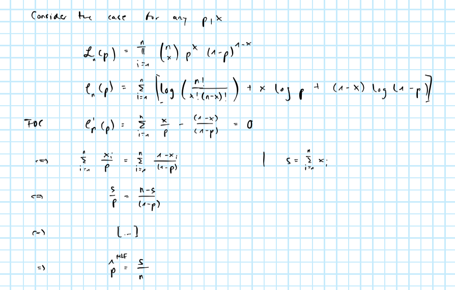

```{r setup, include=FALSE}
knitr::opts_chunk$set(echo = TRUE)
```

## Parametric bootstrap

In exercise 9.7 in Wassermann we are asked to estimate a 90% confidence interval for $\psi(p_1,p_2)=p_1-p_2$ where $p_1,p_2$ represent the probability of success for two RVs

$$
\begin{aligned}
&& X_1&\sim \text{Binomial}(n_1,p_1) \\
&& X_2&\sim \text{Binomial}(n_2,p_2) \\
\end{aligned}
$$
Further we are provided with the following:

$$
\begin{aligned}
&& n_1=n_2&=200 \\
&& X_1&=160 \\
&& X_2&=148 \\
\end{aligned}
$$
We know that $\hat\psi=\hat{p_1}-\hat{p_2}$ (by the continuous mapping theorem) and it can further be shown that $\hat{p_i}=\frac{X_i}{n_i}$ for $i\in\{1,2\}$ where $\hat{p_i}$ is the Maximum Likelihood Estimator. So for the bootstrap we use

$$
\begin{aligned}
&& \hat{p_1}&=\frac{160}{200}, & \hat{p_2}&=\frac{148}{200}\\
\end{aligned}
$$




We can simulate a binomial RV in R as follows

```{r, code=readLines("R/sim_binomial.R")}
```

Applying this procedure for the given parameters and plotting the resulting densities we can say that the in fact look like densities of the corresponding $Gamma(1,b)$ distributions. 

```{r, echo=F}
library(data.table)
library(ggplot2)
ns = c(200,200)
ps = c(160/200,148/200)
N = 10000
X = rbindlist(
  lapply(
    1:2,
    function(i) {
      f_x=density(sim_binomial(N,ns[i],ps[i]))
      data.table(
       i=i,
       x=f_x$x,
       p=f_x$y
      )
    }
  )
)
p = ggplot(X, aes(x=x, y=p, colour=factor(i))) +
  geom_line() +
  scale_color_discrete(name="i:")
p
```

### Bootstrap

We will proceed recursively $B$ times as follows:

1. Simulate (one observation) of

$$
\begin{aligned}
&& X^*_{1b}&\sim \text{Binomial}(n_1,\hat{p}_1) \\
&& X^*_{2b}&\sim \text{Binomial}(n_2,\hat{p}_2) \\
\end{aligned}
$$

2. Compute and store

$$
\begin{aligned}
&& \psi^*_b&= \hat{p}^*_{1b}-\hat{p}^*_{2b}\\
\end{aligned}
$$


To perform the bootstrap we can use the custom `boot` function:

```{r, code=readLines("R/boot.R")}
```

And then we can compute the estimates of interest as follows

```{r}
# Standard error:
B=1000
n=1
p_1_b = boot("X/n_trial", FUN=sim_binomial, B=B, n=n, n_trial=ns[1], p=ps[1])
p_2_b = boot("X/n_trial", FUN=sim_binomial, B=B, n=n, n_trial=ns[2], p=ps[2])
psi_b = p_1_b - p_2_b
psi_hat = ps[1]-ps[2]
se = sqrt(crossprod(psi_b - psi_hat)/B)
# Confidence inteval:
alpha = .1
ci = c(
  psi_hat - qnorm(1-(1/2 * alpha)) * se,
  psi_hat + qnorm(1-(1/2 * alpha)) * se
)
```

which yields the `r 100*(1-alpha)`% confidence interval: $CI_{`r 100*(1-alpha)`\%}=(`r ci[1]`, `r ci[2]`)$. 
